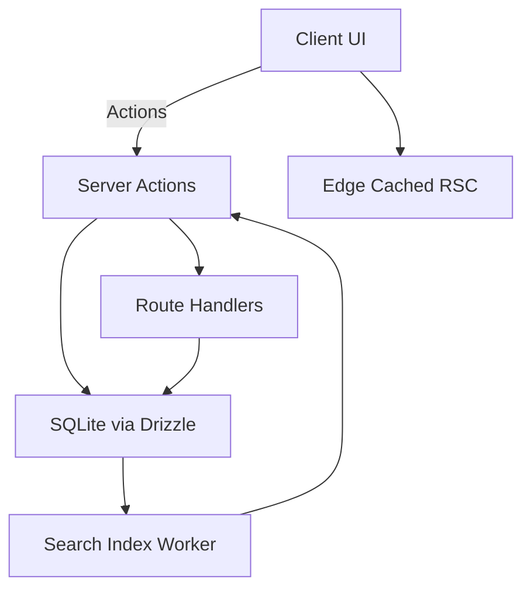
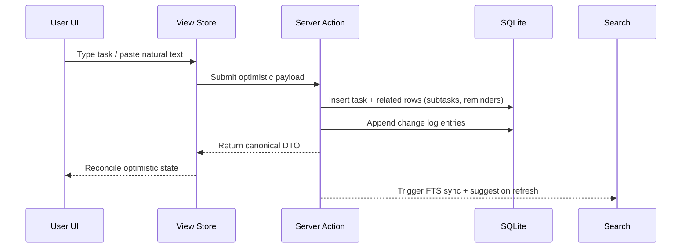

# Next.js Daily Task Planner — Technical & Delivery Plan

## 1. Product Vision & Guiding Principles

- **Purpose:** Deliver a professional, responsive daily planner optimized for rapid task capture, planning, review, and completion.
- **Experience goals:** Zero-friction task entry (including natural language), clarity of daily focus, ambient awareness of overdue/next tasks, delightful micro-interactions (Framer Motion + View Transition API), and resilience (optimistic UI, audit trails, solid tests).
- **Technical guardrails:** Next.js 16 App Router, Bun runtime, strict TypeScript, Tailwind + shadcn/ui design system, Framer Motion animations, SQLite (local-first) via Drizzle ORM, Bun Test coverage, and accessibility-first implementation.

## 2. Major Subsystems & Responsibilities

| Subsystem                                                                                                                | Responsibilities                                                                              | Data Flow                                                                                                                                                   | Key Tech                                                                                     |
| ------------------------------------------------------------------------------------------------------------------------ | --------------------------------------------------------------------------------------------- | ----------------------------------------------------------------------------------------------------------------------------------------------------------- | -------------------------------------------------------------------------------------------- |
| **Presentation Shell** (`app/(dashboard)/layout.tsx`)                                                                    | Split layout, theming, navigation, SSR/CSR handoff, View Transitions orchestration.           | RSC renders shell with sidebar + slots → client components hydrate interactive panels.                                                                      | Next.js App Router layouts, View Transition API, Framer Motion, Tailwind, shadcn/ui.         |
| **List & Label Management** (`app/api/lists/route.ts`, `app/api/labels/route.ts`, `src/server/services/list-service.ts`) | CRUD for inbox/custom lists with emoji/color, label taxonomy, ordering.                       | Client mutations → server actions → Drizzle → revalidate cache segments (list nav, filters).                                                                | Server Actions, Drizzle ORM, SQLite (tables `lists`, `labels`).                              |
| **Task Engine** (`src/server/services/task-service.ts`, `app/api/tasks/route.ts`)                                        | Create/update tasks, enforce validation, manage subtasks, attachments, recurrence, logs.      | Client form / natural language entry → service orchestrates writes across task tables + audit log, returns Task DTO with derived state (overdue, duration). | Zod schemas, Drizzle ORM, file storage via Bun file API, background job queue for reminders. |
| **Scheduling & Views** (`app/(dashboard)/today/page.tsx`, `app/(dashboard)/upcoming/page.tsx`)                           | Query tasks by temporal scopes (Today, Next 7, Upcoming, All) and toggle completed.           | RSC loader composes queries → client view components (virtualized lists, drag-drop).                                                                        | React Server Components, Suspense boundaries, `@tanstack/react-virtual`, Framer Motion.      |
| **State Management Layer** (`src/client/state/view-store.ts`)                                                            | Local UI state: filters, focus task, sheet modals, inline edit.                               | Client-only Zustand store (persist subset) syncing with server via useOptimistic actions.                                                                   | Zustand, React context bridges.                                                              |
| **Search & NLP** (`src/server/services/search-service.ts`, `src/server/services/nlp-service.ts`)                         | Fuzzy search across tasks/lists/labels, natural language parsing, smart suggestions.          | Indexed nightly job builds SQLite FTS5 virtual table; search route streams results. NLP parses text → structured task payload.                              | SQLite FTS5, `lunr` (client fallback), `chrono-node`, custom heuristic scheduler.            |
| **Reminders & Notifications** (`src/server/services/reminder-service.ts`, `src/jobs/reminder-dispatcher.ts`)             | Manage reminder schedules, send notifications via email/push/local.                           | Cron job scans upcoming reminders, dispatches via Notification API / email adapter.                                                                         | Bun scheduler (crontab), Web Push (later), Notification API fallback.                        |
| **Audit & Analytics** (`src/server/services/audit-service.ts`)                                                           | Persist all task field changes, expose timeline view per task.                                | After Drizzle transactions, append change log rows + derived metrics (est vs actual).                                                                       | SQLite `task_change_log`, server components for timeline.                                    |
| **Testing & Tooling**                                                                                                    | Provide coverage for units, integration, and E2E (Playwright-on-Bun or `bun test --preload`). | Tests run in CI (Bun), seeded SQLite DB, component tests via React Testing Library.                                                                         | Bun Test, MSW for API mocks, Drizzle migrations in tests.                                    |

## 3. Data Model (SQLite via Drizzle)

| Table                 | Key Fields                                                                                                                                                                                                                         | Notes                                                        |
| --------------------- | ---------------------------------------------------------------------------------------------------------------------------------------------------------------------------------------------------------------------------------- | ------------------------------------------------------------ |
| `users`               | `id`, `email`, `name`, `timezone`, `settings` JSON                                                                                                                                                                                 | Future multi-user; store theme prefs, notification channels. |
| `lists`               | `id`, `user_id`, `name`, `emoji`, `color`, `sort_order`, `is_system`                                                                                                                                                               | Inbox flagged as system + immutable delete.                  |
| `labels`              | `id`, `user_id`, `name`, `emoji`, `color`                                                                                                                                                                                          | Unique per user.                                             |
| `tasks`               | `id`, `user_id`, `list_id`, `title`, `description`, `scheduled_date`, `deadline`, `priority`, `estimate_minutes`, `actual_minutes`, `status`, `recurrence_rule_id`, `attachment_count`, `created_at`, `updated_at`, `completed_at` | `status` drives overdue logic.                               |
| `task_labels`         | `task_id`, `label_id`                                                                                                                                                                                                              | Junction.                                                    |
| `subtasks`            | `id`, `task_id`, `title`, `is_done`, `order_index`                                                                                                                                                                                 | Checklist semantics.                                         |
| `attachments`         | `id`, `task_id`, `file_name`, `mime_type`, `size`, `storage_path`                                                                                                                                                                  | Bun file storage (local `/uploads`).                         |
| `reminders`           | `id`, `task_id`, `remind_at`, `channel`, `status`, `snooze_count`                                                                                                                                                                  | Channel enum: email, push, in-app.                           |
| `recurrence_rules`    | `id`, `task_id`, `rrule_text`, `timezone`, `next_occurrence`                                                                                                                                                                       | RFC5545-compatible text for custom recurrence.               |
| `time_entries`        | `id`, `task_id`, `type` (estimate/actual), `minutes`, `source`, `recorded_at`                                                                                                                                                      | Allows multiple actuals.                                     |
| `availability_blocks` | `id`, `user_id`, `start_at`, `end_at`, `type` (focus/busy/free)                                                                                                                                                                    | Powers smart scheduling.                                     |
| `task_change_log`     | `id`, `task_id`, `changed_by`, `field`, `previous_value`, `new_value`, `changed_at`                                                                                                                                                | Rendered in task history.                                    |
| `fts_tasks` (virtual) | `content` columns referencing tasks/list/labels                                                                                                                                                                                    | FTS5 table kept in sync via triggers.                        |

All Drizzle schema definitions live in [`src/server/db/schema.ts`](src/server/db/schema.ts) with migrator scripts in [`src/server/db/migrations`](src/server/db/migrations).

## 4. Theming, Layout, and View Transitions

- **Theming:** Use `next-themes` inside [`app/providers.tsx`](app/providers.tsx) to respect system theme, storing preference per user. Tailwind config defines semantic color tokens (surface, accent, warning). shadcn/ui tokens mapped via CSS variables.
- **Layout:** [`app/(dashboard)/layout.tsx`](<app/(dashboard)/layout.tsx>) composes Sidebar (server-rendered list of lists/labels) and main content slot. Sidebar uses sticky sections for Views, Lists, Labels with animated badge counts via Framer Motion.
- **Responsive strategy:** CSS grids + flex with Tailwind breakpoints. Mobile collapses sidebar into drawer (shadcn Sheet) with accessible toggles.
- **View Transition API:** Wrap route segment transitions with `useViewTransition` helper in [`src/client/hooks/use-view-transition.ts`](src/client/hooks/use-view-transition.ts). Trigger transitions on navigation + list filter changes for fluidity.
- **Loading & errors:** Route segments use Suspense boundaries with shimmer skeletons (shadcn Skeleton). Global error boundary in [`app/error.tsx`](app/error.tsx) shows actionable retry.

## 5. Task Capture, Editing, and Logging Flow

- **Forms:** Implement with shadcn forms + `react-hook-form`, validated by Zod schemas in [`src/schemas/task.ts`](src/schemas/task.ts).
- **Change log:** After every mutation, `task_change_log` entries stored and surfaced via timeline component [`src/features/tasks/components/task-history.tsx`](src/features/tasks/components/task-history.tsx).

## 6. Search, NLP, and Smart Scheduling

- **Fuzzy search:** Use SQLite FTS5 via triggers for canonical source. Client search box in [`src/features/search/components/command-palette.tsx`](src/features/search/components/command-palette.tsx) debounces input, calls `/api/search`. For offline/instant fallback, hydrate small Lunr index in Service Worker.
- **Natural language entry:** [`src/server/services/nlp-service.ts`](src/server/services/nlp-service.ts) uses `chrono-node` + custom grammar for labels (“#design”), list targeting (“in Project Atlas”), reminders (“remind me 30m before”), durations (“estimate 2h”). UI exposes quick-add bar with ghost text hint.
- **Smart suggestions:** [`src/server/services/scheduler-service.ts`](src/server/services/scheduler-service.ts) ingests `availability_blocks`, existing tasks, and durations to recommend slots. Ranking heuristics: urgency, priority, estimate fit, focus block alignment. Suggestions displayed in modal card after quick add; user can accept to auto-assign date/time.

## 7. Reminders & Notifications

- Store reminders per task; support multiple channels. A Bun cron worker [`src/jobs/reminder-dispatcher.ts`](src/jobs/reminder-dispatcher.ts) runs every minute, queries upcoming reminders, dispatches notifications:
  - In-app toast via WebSocket channel (Next.js Route Handler + `@vercel/edge` optional later).
  - Web Push (stretch) requiring subscription storage in `user_notification_channels` table.
  - Email via provider adapter abstraction.
- Snooze updates reminder rows and logs change.

## 8. Testing Strategy (Bun Test)

| Layer        | Scope                                                                                                | Tooling                                                                                               |
| ------------ | ---------------------------------------------------------------------------------------------------- | ----------------------------------------------------------------------------------------------------- |
| Unit         | Services (`task-service`, `nlp-service`, `scheduler-service`), hooks, and utils.                     | Bun Test + `bun:test` runner, use factory helpers with in-memory SQLite (better-sqlite3).             |
| Integration  | Server Actions with Drizzle, API routes, View components with data fetching (using MSW + mocked DB). | Bun Test + MSW, run against temp SQLite file seeded via migrations.                                   |
| Component/UI | Critical UI pieces (Task card, Quick Add, Sidebar).                                                  | React Testing Library + Bun JSDOM.                                                                    |
| E2E          | Core flows: create/edit task, toggle views, search, natural language entry, reminder firing.         | Playwright run via Bun (or `bunx playwright test`), using seeded DB and mocked notification adapters. |
| Performance  | Lighthouse CI focusing on interaction-to-next-paint and bundle size budgets.                         | `next lint`, `bunx @lhci/cli autorun`.                                                                |

Include fixtures + factories in [`tests/factories`](tests/factories) and run via GitHub Actions workflow `bun test && bunx playwright test`.

## 9. Implementation Roadmap

- [x] **Foundation & Tooling**
    - [x] Initialize Next.js (App Router) with Bun, Tailwind, shadcn/ui, Drizzle, testing harness.
    - [x] Configure linting, formatting, CI pipeline, environment management.
- [ ] **Database & Services** _(partial: schema + core list/label/task/reminder services drafted, migrations generated; audit/search/NLP still pending)_
    - [x] Define schema + migrations, write service layer for lists, tasks, labels, reminders (initial versions).
    - [ ] Implement audit log UI hooks + triggers for FTS + change history.
- [ ] **Core UI Layout & Navigation**
    - [ ] Build dashboard layout, sidebar, view routes (Today, Next 7, Upcoming, All) with server data fetching.
    - [ ] Implement list/label CRUD modals.
- [ ] **Task CRUD & Logging**
    - [ ] Quick add bar, detailed task drawer, subtasks, attachments, change log UI.
    - [ ] Form validation, optimistic updates, View Transitions.
- [ ] **Search + NLP + Suggestions**
    - [ ] Command palette with fuzzy search, NLP parser integration, scheduler suggestion surface.
- [ ] **Reminders & Notifications**
    - [ ] Reminder CRUD, dispatcher worker, in-app notifications.
- [ ] **Polish & Stretch**
    - [ ] Animations, micro-interactions, performance tuning, responsive tweaks, accessibility sweeps.
    - [ ] Complete Bun Test/Playwright suites, add Lighthouse regression.

Each milestone ends with regression + accessibility review before proceeding.

## 10. Risks & Mitigations

- **State divergence between optimistic UI and server:** Use canonical DTO responses + React cache invalidation per segment.
- **Natural language ambiguity:** Provide preview chips showing parsed fields before save; allow user corrections.
- **SQLite concurrency under Bun:** Wrap writes in transactions and serialize via single connection pool. Consider migrating to Turso later.
- **Notification reliability:** Start with in-app reminders (guaranteed) before external channels; log dispatch outcomes for debugging.
